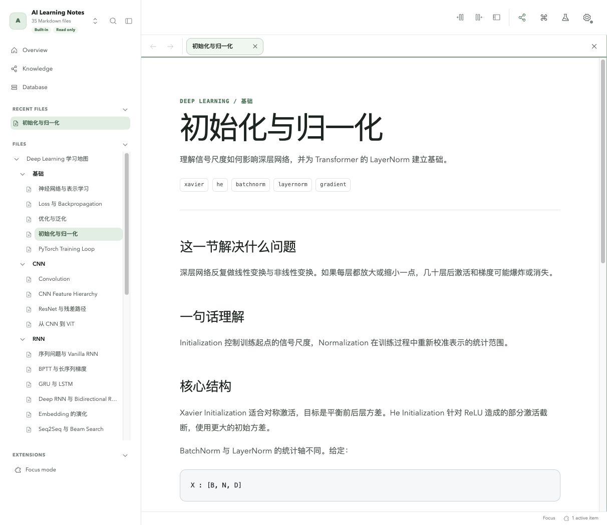
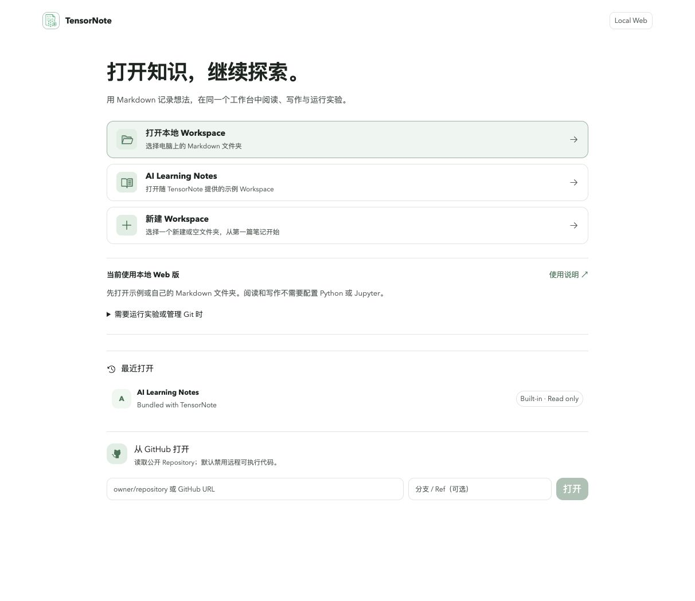
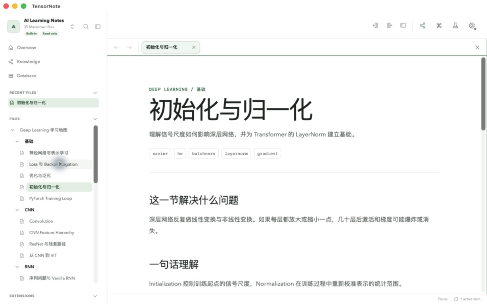

<p align="center"></p>

# TensorNote

中文（默认） · [English](README.en.md)

**用普通 Markdown 文件管理知识，在同一个工作台中阅读、写作、连接知识与运行 Python 实验。**

[在线体验](https://aaronchou313.github.io/tensornote/) · [下载应用](https://github.com/AaronChou313/tensornote/releases) · [使用说明](docs/zh-CN/USER_GUIDE.md) · [版本说明](docs/releases/v1.6.0.md)

[](https://github.com/AaronChou313/tensornote/actions/workflows/ci.yml) [](https://github.com/AaronChou313/tensornote/releases/latest) [](LICENSE)



知识正文、属性、链接和实验都保存在 Markdown、附件与 `tensornote.yaml` 中。索引、图谱和 Database 可从源文件重建，内容不依赖私有数据库。应用采用白色与淡绿的简洁工作台，也提供深色主题。

## 选择适合你的版本

| | 在线 Web | 本地 Web | 桌面版 |
| --- | --- | --- | --- |
| 开始使用 | 打开 GitHub Pages | 下载 Local Web 包，Node.js 22+ 运行 `node start.mjs` | 下载并安装对应系统/架构的应用 |
| 阅读来源 | 示例、公开 GitHub、本地授权目录¹ | 同左 | 示例、公开 GitHub、原生本地目录 |
| 编辑保存 | 本地授权目录¹；GitHub/示例只读 | 本地授权目录¹ | 本地目录 |
| 执行 Python | HTTPS Jupyter、JupyterHub、BinderHub | 本机 Jupyter 或 HTTPS 远程计算 | 本地环境助手启动 Jupyter，也支持远程计算 |
| Git | 无本地 Git 集成 | 可选 Git Bridge + 系统 Git | 系统 Git，无需 Bridge |
| 离线能力 | 页面缓存有限；远程内容/计算需网络 | 本地应用、笔记与已安装 Python 可离线 | 本地笔记与已安装 Python 可离线 |
| 推荐用途 | 快速体验与分享 | 喜欢浏览器工作流 | 每天维护自己的知识库与实验 |

¹ 浏览器本地读写需要 Chrome/Edge 的 File System Access API 和你的目录授权；Safari/Firefox 可读远程内容，本地创作建议桌面版。所有版本阅读和写作都不需要 Jupyter。首次安装工具、下载依赖、访问 GitHub 或远程计算需要网络。

## 从下载到第一次使用

**最快体验：** 打开[在线版](https://aaronchou313.github.io/tensornote/)，点击 **AI Learning Notes**。想修改示例时，先下载/克隆自己的副本，通过本地目录入口打开。

**本地 Web：** 在 [Releases](https://github.com/AaronChou313/tensornote/releases) 下载 `TensorNote-local-web-1.6.0.tar.gz`，解压，在该目录运行：

```sh
node start.mjs
```

用 Chrome/Edge 打开 `http://127.0.0.1:5173`，选择 Markdown 文件夹。包内已编译完成，无需 pnpm、安装前端依赖或手动构建。保持终端运行，`Ctrl+C` 停止。不要把个人知识库放在包内 `app/` 目录。

**桌面版：** 下载适合你的系统和 CPU 的安装包，安装 → 打开本地 Workspace → 新建笔记 → 编辑并保存。无需 Node.js 或 Web 服务。macOS Apple Silicon 和 Intel 包不可混淆。

GitHub 社区发行不要求购买开发者账户；当前包没有 Apple Developer ID 公证或 Windows 受信发布者签名，首次安装可能有系统提示。请核对来源与 `SHA256SUMS`，按[安装说明](docs/zh-CN/USER_GUIDE.md#2-下载和第一次打开)操作。Updater 的密码学签名仍必须验证。平台实测范围见版本说明；不宣称所有操作系统都已完成干净机器验收。

`TensorNote-web-1.6.0.tar.gz` 是供 `/tensornote/` 路径部署的 Static Web 包；GitHub 自动生成的 Source code 是开发源码。普通本地 Web 用户选择 **local-web** 包。

## 需要实验或 Git 时再配置

- **在线计算：** 设置 → 计算与 Jupyter → 选择 Generic Jupyter / JupyterHub / BinderHub。使用自己的 HTTPS 服务地址、身份和 Kernel；服务需允许 TensorNote Origin 与 WebSocket。普通 Notebook 分享链接不能直接连接。完整步骤见[在线计算说明](docs/zh-CN/USER_GUIDE.md#compute)。
- **本地 Web 实验：** 在自己的 Python 环境启动 Jupyter，填入地址、Token 和 Kernel，运行连接诊断。说明书提供可复制的命令。
- **桌面实验：** 运行时助手检测环境 → 选择环境 → “启动并使用”。没有环境时先审阅基础环境安装计划；PyTorch/CUDA 等额外依赖由用户审核安装。
- **本地 Web Git：** 在应用包目录另开终端运行 `node scripts/git-bridge.mjs --workspace "/你的知识库绝对路径"`，然后在 Git 页面连接 `http://127.0.0.1:4318`。知识库需为 Git 仓库。
- **桌面 Git：** 安装系统 Git，打开仓库即可；无需 Bridge。

Git 工作台支持 Status、Diff、Stage/Unstage、History 和 Commit。**Commit 不会自动上传到 GitHub；Push/Pull、Clone、分支与远程凭据由 Git 客户端处理。**

## 能做什么

- Markdown 编辑、公式、Mermaid、附件、属性、草稿恢复和外部修改冲突保护。
- WikiLinks、反向链接、标签、Outline、局部图谱、全文搜索和学习进度。
- 独立标签与分栏阅读/编辑、命令面板、明暗主题和响应式侧栏。
- 多 Cell Python Lab、Scratch、顺序运行、中断、重启、计算 Profile 与诊断。
- 从 Frontmatter 重建 Database，在 Table、Card 和 List 视图组织笔记。
- 固定 GitHub Revision 分享和发布知识库；代码执行需要显式授权。
- 通用 Agent Skill、模板、严格校验与可移植 Schema v1。

## 最新界面快照

以下是真实 1.6.0 Web/Desktop 应用截图，使用随仓库提供的示例内容。

| 本地 Web 首页 | 桌面阅读 |
| --- | --- |
|  |  |

## 让智能体维护知识库

下载同版本 `TensorNote-agent-skill-1.6.0.tar.gz`，把解压目录中的 `SKILL.md` **和全部引用文件**交给智能体，并明确指定你的知识库目录。它可按现有规范生成、更新、整理链接与附件、检查前置关系并运行校验器。

在 Skill 目录安装独立依赖后验证知识库：

```sh
npm ci
node scripts/validate-workspace.mjs "/你的知识库绝对路径" --strict
```

这是基于可移植文件的维护协议；不会向任意智能体开放桌面 Shell。Token、密码和密钥不得进入知识库或 Git。

## 文档与开发

- [中文使用说明](docs/zh-CN/USER_GUIDE.md) / [English user guide](docs/en/USER_GUIDE.md)：安装、读写、三种计算路径、Git、Agent、升级和故障处理。
- [平台契约](docs/PLATFORM_CONTRACTS.md)、[架构](docs/ARCHITECTURE.md)、[宿主功能边界](docs/HOST_FEATURE_MATRIX.md)。
- [开发说明](docs/DEVELOPMENT.md)、[维护者交接](docs/AGENT_HANDOFF.md)、[发布矩阵](docs/RELEASE_MATRIX.md)。

源码开发需要 Node.js 22+ 和 pnpm 11：

```sh
pnpm install --frozen-lockfile
pnpm dev
pnpm check
```

桌面开发还需要 Rust 和平台构建工具，运行 `pnpm dev:desktop`。用户数据以 Workspace Schema v1 为兼容边界。欢迎在 [Issues](https://github.com/AaronChou313/tensornote/issues) 提交复现步骤或改进建议，分享前删除私密内容。许可证为 [Apache-2.0](LICENSE)。
