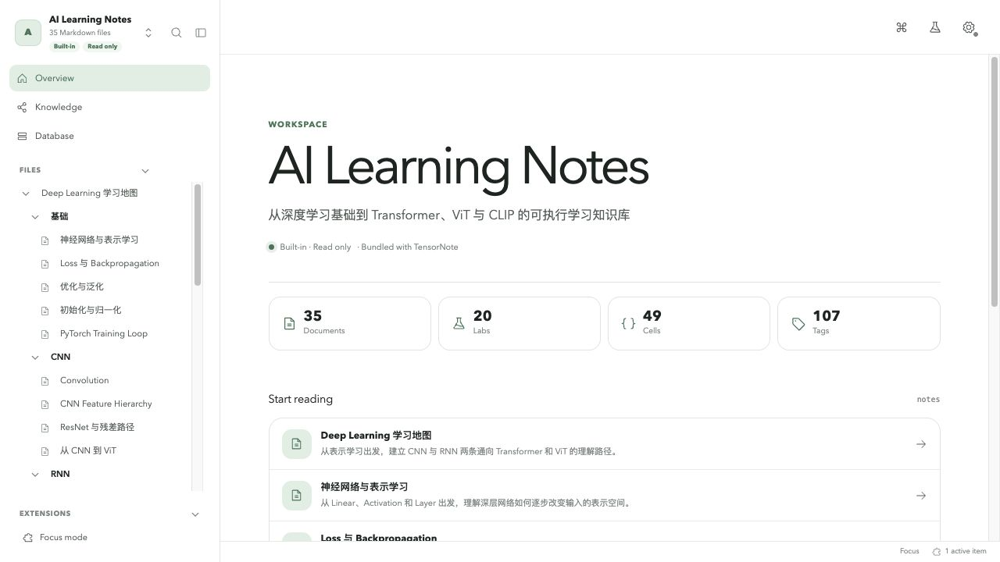
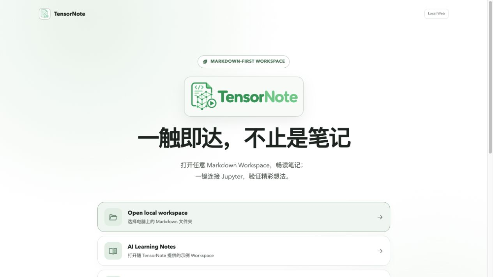
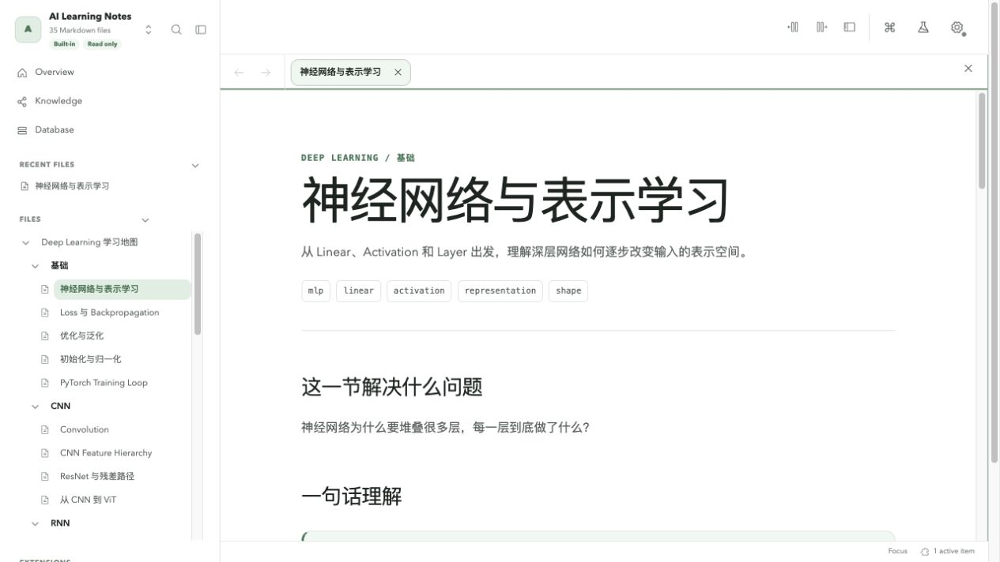
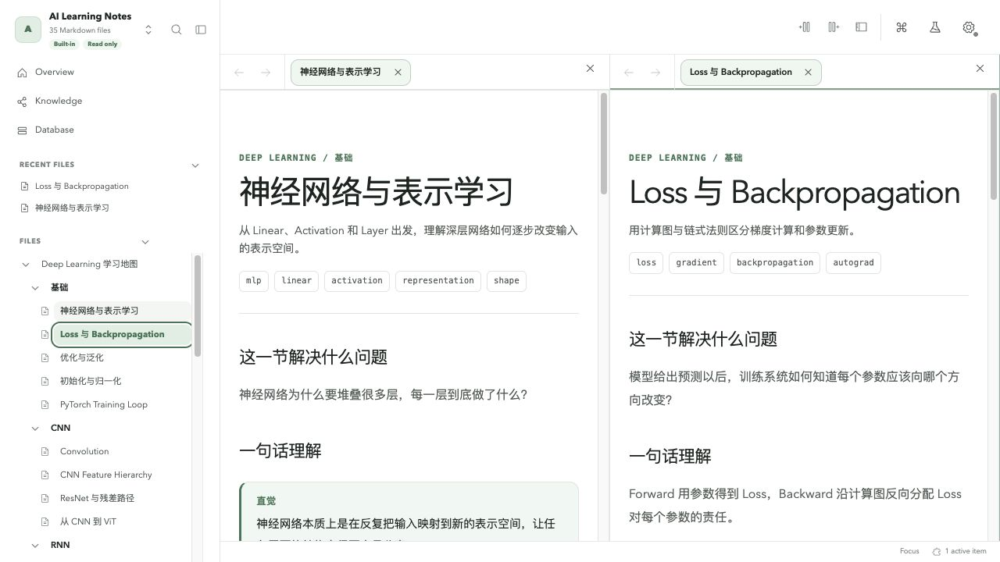
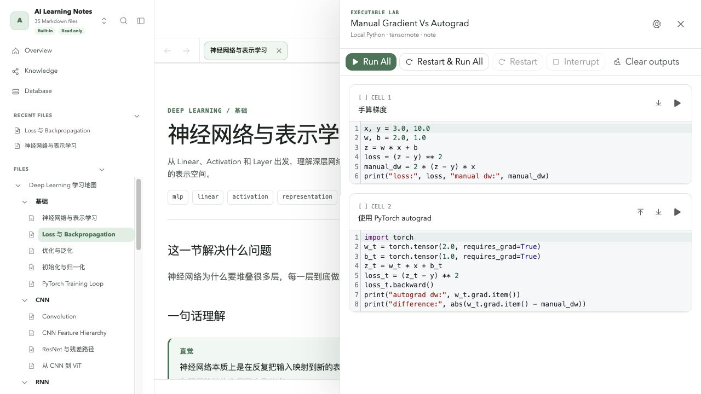
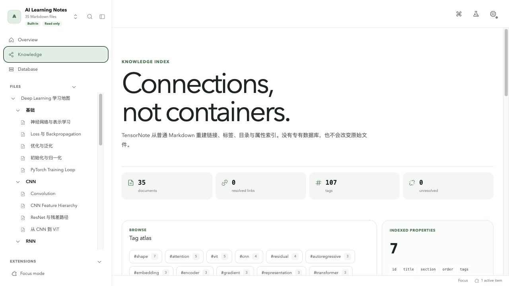
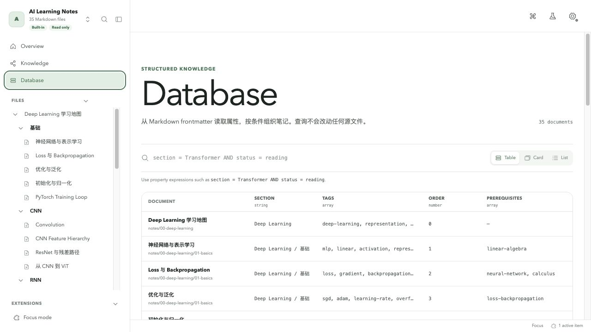
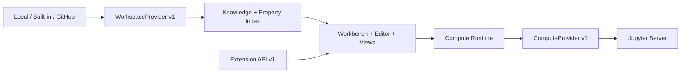

<p align="center">
  
</p>

<h1 align="center">TensorNote</h1>

<p align="center">
  <strong>Markdown-first executable knowledge workspace.</strong><br>
  用普通文件管理知识，在同一个工作台中阅读、写作、连接知识，并运行可复现的 Python 实验。
</p>

<p align="center">
  <a href="https://github.com/AaronChou313/tensornote/actions/workflows/ci.yml"></a>
  <a href="https://github.com/AaronChou313/tensornote/releases/tag/v1.0.0"></a>
  <a href="LICENSE"></a>
  
  
  
</p>

<p align="center">
  <a href="#为什么是-tensornote">产品理念</a> ·
  <a href="#功能">功能</a> ·
  <a href="#界面预览">界面预览</a> ·
  <a href="#快速开始">快速开始</a> ·
  <a href="#python-lab">Python Lab</a> ·
  <a href="#智能体接口">智能体接口</a> ·
  <a href="#参与贡献">参与贡献</a>
</p>



TensorNote 是一个本地优先、Markdown 优先的可执行知识 Workspace。知识正文、属性、链接和实验定义都保存在可读、可迁移、适合 Git 的文件中；索引、图谱和 Database 可以随时从源文件重建。应用不把知识锁进私有数据库，也不会在未授权时执行代码。

当前稳定版本为 **v1.0.0 — Stable Platform**。六项平台契约、Release Gate、浏览器主流程、Static 与容器分发均已完成验证。详见 [v1.0.0 发布计划](docs/V1_RELEASE_PLAN.md)与[发布说明](docs/releases/v1.0.0.md)。

## 为什么是 TensorNote

- **内容属于你**：笔记就是 `.md`，图片就是普通 Assets，Workspace 行为由 `tensornote.yaml` 描述。
- **知识与实验不分家**：阅读概念、查看公式、编辑源码、运行多 Cell Python Lab 都在同一上下文完成。
- **本地优先，来源统一**：本地文件夹、内置示例和公开 GitHub Repository 通过相同的 Workspace 接口呈现。
- **能力显式授权**：写入、代码执行、Git 和本地扩展都由 Provider capability、Manifest 与用户操作共同决定。
- **平台边界稳定**：Workspace、Compute、Extension、Executable Markdown 与 Settings 已冻结为 v1 契约。

## 功能

| 能力 | 具体功能 |
| --- | --- |
| **Markdown 创作** | CodeMirror 6 编辑器、图标化格式工具栏、Properties 面板、图片/附件、文件与目录管理、草稿恢复、外部修改冲突保护。 |
| **知识系统** | WikiLink、嵌入、Alias、Tags、Backlinks、Outline、局部 Graph、全文搜索、学习进度与未解析链接检查。 |
| **多窗格 Workbench** | 独立 Pane、Tabs、History 与滚动状态；左右分栏、焦点上下文、命令面板、设置弹窗、可折叠侧栏与响应式布局。 |
| **Python Lab** | 多 Cell executable fence、Scratch Lab、Run/Run All/Run Above/Below、Restart、Interrupt、输出管理、Compute Profile 与连接诊断。 |
| **Structured Knowledge** | 从 YAML Frontmatter 重建属性索引，以表达式查询笔记，并在 Table、Card、List 视图之间切换。 |
| **Git & Sync** | 可选 Local Git Bridge；查看状态、Diff 与历史，Stage/Unstage 并创建本地 Commit，不暴露任意 Shell。 |
| **Extension Platform** | Command、View、Sidebar、Markdown Processor、Editor、Settings、Status Bar、Workspace 与 Compute Provider 扩展点。 |
| **分发与恢复** | Local、Static、Self-hosted Web、可选 PWA；未来 Schema 只读降级、应用级错误恢复和大 Workspace 性能门。 |

## 界面预览

所有图片均来自本仓库 `v1.0.0` 的真实浏览器流程，而非设计稿。

| 启动与知识浏览 | 笔记阅读 |
| --- | --- |
| [](docs/images/screenshots/01-home.png)<br>打开本地文件夹、内置示例或公开 GitHub Workspace。 | [](docs/images/screenshots/04-note-reading.png)<br>渲染 Markdown、KaTeX、Mermaid、Callout、链接、属性与实验卡片。 |

| 独立分栏 | 可执行实验 |
| --- | --- |
| [](docs/images/screenshots/05-split-workbench.png)<br>每个阅读编辑区拥有独立标签、历史、焦点和滚动状态。 | [](docs/images/screenshots/06-python-lab.png)<br>从笔记直接打开多 Cell Lab，并共享可控的 Compute Session。 |

| 知识空间 | 结构化 Database |
| --- | --- |
| [](docs/images/screenshots/03-knowledge.png)<br>浏览标签、属性、链接关系和待修复的知识连接。 | [](docs/images/screenshots/08-structured-database.png)<br>查询 Frontmatter，并切换 Table、Card 和 List。 |

设置统一收纳外观、编辑器、Compute、扩展与平台版本信息：[查看设置截图](docs/images/screenshots/07-settings.png)。

## Workspace 类型

| 来源 | 阅读 | 编辑 | Python Lab | Git 工作台 |
| --- | :---: | :---: | :---: | :---: |
| 本地文件夹 | ✓ | ✓ | 显式授权后 | 可选 Bridge |
| 内置示例 | ✓ | — | 仅阅读定义 | — |
| 公开 GitHub Repository | ✓ | — | 信任当前 Revision 后 | — |

本地创作依赖支持 [File System Access API](https://developer.mozilla.org/docs/Web/API/File_System_API) 的桌面 Chromium 浏览器。Safari/Firefox 或权限受限环境仍可使用只读来源。

## 快速开始

### 环境要求

- Node.js 22 或更新版本
- pnpm 11（仓库固定为 `pnpm@11.24.0`）
- 桌面 Chrome 或 Edge；本地目录读写时必须
- Python 3.10+ 与 Jupyter Server；仅运行 Python Lab 时需要

### 启动应用

```bash
git clone https://github.com/AaronChou313/tensornote.git
cd tensornote
corepack enable
pnpm install --frozen-lockfile
pnpm dev --host localhost --port 5173 --strictPort
```

打开 <http://localhost:5173>，然后选择：

1. **Open local workspace**：选择自己的 Markdown 文件夹；
2. **AI Learning Notes**：立即体验随仓库提供的完整示例；
3. **GitHub repository**：输入 `owner/repository`、URL 与可选 Ref，读取公开仓库。

完整的 Conda、`venv`、`uv`、Jupyter Kernel、CORS 与每日启动顺序见[环境配置与使用手册](docs/ENVIRONMENT_SETUP.md)。

### 每日需要启动什么

| 终端 | 什么时候需要 | 命令 |
| --- | --- | --- |
| 1 · TensorNote | 总是 | `pnpm dev --host localhost --port 5173 --strictPort` |
| 2 · Jupyter | 运行 Python Lab | `jupyter server --ServerApp.allow_origin=http://localhost:5173` |
| 3 · Git Bridge | 在应用内使用本地 Git | `pnpm git:bridge -- --workspace /absolute/path/to/workspace` |

Jupyter 应保留 Token 验证，不要使用 `allow_origin=*`。通过 `jupyter server list` 获取 Server URL 与 Token，再到“设置 → 计算与 Jupyter”配置 Compute Profile。

## Workspace 规格

Workspace 根目录可选放置 `tensornote.yaml`：

```yaml
schemaVersion: 1
workspace:
  name: My Knowledge Base
  description: Portable Markdown notes
content:
  root: notes
assets:
  root: assets
navigation:
  mode: filesystem
features:
  executable: true
environment:
  files:
    - requirements.txt
```

没有 Manifest 时仍可作为普通 Markdown 文件夹打开，但执行能力默认关闭。用户可以在“设置 → 计算与 Jupyter”按设备、按 Workspace 临时授权；本地偏好不会改写仓库配置。

一篇可连接的笔记可以保持完全标准的 Markdown：

```markdown
---
title: Self-Attention
aliases: [Scaled Dot-Product Attention]
tags: [transformer, attention]
status: growing
---

继续阅读 [[Multi-Head Attention#核心结构|多头注意力]]。

> [!intuition]
> Attention 让每个 Token 根据当前任务重新组合上下文。
```

知识系统的完整语法见[知识系统使用说明](docs/KNOWLEDGE_SYSTEM.md)，属性查询见[Structured Knowledge 使用指南](docs/STRUCTURED_KNOWLEDGE.md)。

## Python Lab

普通 Python fence 只负责展示；增加 `exec` 和元数据后，TensorNote 会把同一 `lab` 的 Cell 聚合成可执行实验：

````markdown
```python exec lab="attention-shapes" cell="1" title="构造输入" difficulty="basic"
import torch
X = torch.randn(4, 8)
```

```python exec lab="attention-shapes" cell="2" title="检查形状" difficulty="basic"
assert X.shape == (4, 8)
print(X.shape)
```
````

编辑器中的“实验”工具可以创建 Lab、设置实验标识与难度、添加多个 Cell，并把选中代码带入第一个 Cell。Scratch Lab 的代码只有在用户点击 **Insert into note** 后才会写入 Markdown。

运行代码还需要同时满足：Workspace 允许执行、用户连接自己的 Compute Profile；GitHub 来源还要信任当前 Commit Revision。详见 [Compute Platform 使用说明](docs/COMPUTE_PLATFORM.md)。

## 架构与稳定契约



v1 公共入口是 [`src/platform/index.ts`](src/platform/index.ts)。稳定范围包括：

- Workspace Repository Schema v1
- WorkspaceProvider API v1
- ComputeProvider API v1
- Extension API v1
- Executable Markdown Syntax v1
- Settings / Secret Model v1

契约、兼容策略和 Secret 边界见 [Platform Contracts](docs/PLATFORM_CONTRACTS.md)，整体模块见[架构说明](docs/ARCHITECTURE.md)。

## 分发

生产构建：

```bash
pnpm build
pnpm preview
```

Self-hosted Web：

```bash
docker compose up --build -d
```

仓库也提供 Static Base Path、手动 GitHub Pages Workflow 与 PWA。部署变量、Nginx 容器和离线边界见[分发与部署](docs/DISTRIBUTION.md)。

## 智能体接口

仓库内置可安装的 [`$tensornote-knowledge-workspace`](skills/tensornote-knowledge-workspace/SKILL.md) Skill，告诉智能体如何：

- 设计 Workspace、目录、Frontmatter、链接与 Assets；
- 编写带明确状态依赖的多 Cell Python Lab；
- 使用 Conda、`venv` 或 `uv` 配置并运行 TensorNote/Jupyter；
- 通过确定性脚本校验 Schema、ID、链接、资源与 Lab 元数据。

```bash
node skills/tensornote-knowledge-workspace/scripts/validate-workspace.mjs /path/to/workspace --strict
```

安装、调用示例、模板与安全边界见[智能体接口说明](docs/AGENT_INTEGRATION.md)。

## 开发与质量门

```bash
pnpm check
pnpm test:performance
pnpm audit --prod --audit-level high

VITE_TENSORNOTE_DEPLOYMENT=static \
VITE_BASE_PATH=/tensornote/ \
pnpm build
```

`pnpm check` 顺序执行测试、ESLint 与 TypeScript/Vite Build。CI 还验证内置 Workspace、严格模板、Static Build 与 Docker 镜像。

| 文档 | 内容 |
| --- | --- |
| [Workbench](docs/WORKBENCH.md) | 布局、Pane、Tabs、命令、编辑与快捷键 |
| [Environment Setup](docs/ENVIRONMENT_SETUP.md) | Conda/venv/uv、Jupyter、每日启动与故障排查 |
| [Compute Platform](docs/COMPUTE_PLATFORM.md) | Profile、Session Scope、执行、诊断与安全 |
| [Git & Sync](docs/GIT_AND_SYNC.md) | Local Git Bridge、Diff、Stage 与 Commit |
| [Extensions](docs/EXTENSIONS.md) | Manifest、权限、API 与示例扩展 |
| [Recovery](docs/RECOVERY.md) | 草稿恢复、冲突保护与错误边界 |
| [Development](docs/DEVELOPMENT.md) | 更新功能、版本流程与发布规范 |
| [Hardening](docs/HARDENING.md) | 兼容、性能、安全和分发限制 |
| [Next Generation Plan](docs/NEXT_GENERATION_PLAN.md) | Web/Desktop 双宿主、本地/远程 Workspace 与 Compute、开放知识发布生态 |

## 参与贡献

欢迎提交可复现的问题、文档改进和小而清晰的 Pull Request。开始前请阅读：

- [贡献指南](CONTRIBUTING.md)
- [支持与问题反馈](SUPPORT.md)
- [安全策略](SECURITY.md)
- [社区行为准则](CODE_OF_CONDUCT.md)

功能路线以 [Roadmap](docs/ROADMAP.md)、[下一代规划](docs/NEXT_GENERATION_PLAN.md)和 [v1 发布计划](docs/V1_RELEASE_PLAN.md)为准。重大平台变化应先讨论，再修改稳定契约。

## License

TensorNote 使用 [Apache License 2.0](LICENSE) 发布。Copyright 2026 AaronChou313。该许可证允许商业使用、修改与再分发，并包含明确的专利授权；项目名称与 Logo 的商标权不随许可证自动授予。第三方依赖信息见 [Third-party notices](THIRD_PARTY_NOTICES.md)。
