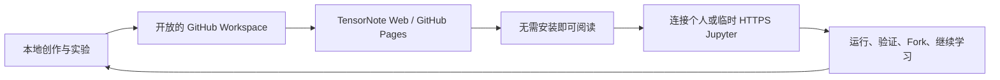
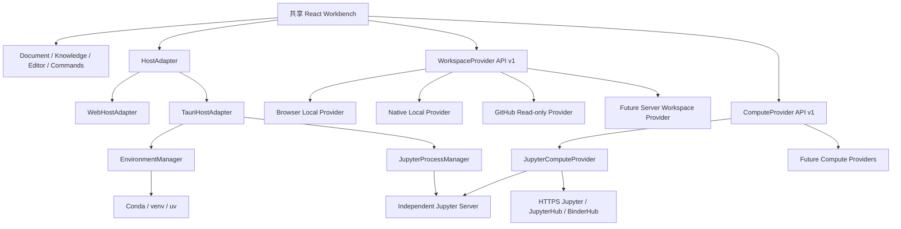

# TensorNote 下一代产品与架构规划

状态：执行中；`v1.2.0` 源码阶段已完成

基线：`v1.0.0 — Stable Platform`

规划范围：`v1.1–v1.x`；只有无法保持 v1 契约兼容的变化才进入 `v2.0.0`

更新时间：2026-09-01

## 1. 执行摘要

TensorNote 下一阶段不再以继续堆叠编辑器功能为中心，而是把已经稳定的 Markdown Workspace、Jupyter Compute 和 Web 分发能力扩展成一套双宿主、双来源、可发布的开放学习系统：

- **Web Runtime** 继续提供无需安装的 Built-in/GitHub 阅读、本地目录读写（浏览器允许时）和手动连接 HTTPS Jupyter。
- **Desktop Runtime** 使用 Tauri 2 承载同一套 React 产品界面，增加原生文件、环境检测、进程管理、本地 Git、系统集成和安装包能力。
- **Workspace 与 Compute 相互独立**：知识库和 Jupyter 都可以位于本地或远程，任意组合不改变笔记格式。
- **发布仍以 GitHub Repository 为中心**：创作者在本地撰写并验证知识库，发布后由其他用户在线阅读，并按需连接自己的远程计算环境运行实验。

下一代 TensorNote 的一句话定位是：

> 本地创作，开放发布，在线阅读，按需计算。

## 2. 产品愿景

TensorNote 面向 AI、ML、DL、RL、LLM 及其他需要“概念理解 + 代码验证”的学习与研究场景。它不取代 Markdown、Git、Python 或 Jupyter，而是把这些开放工具组织成一个连贯工作流：



这一闭环同时服务四类角色：

| 角色 | 核心任务 | TensorNote 提供的价值 |
| --- | --- | --- |
| 创作者 | 整理知识、编写实验、持续迭代 | 本地 Markdown、Jupyter、Git 和结构化知识统一工作台 |
| 发布者 | 把知识库变成可访问的学习资源 | GitHub Repository、Pages 模板、固定 Revision 和发布检查 |
| 学习者 | 阅读、搜索、理解并验证代码 | 在线只读知识库、个人计算环境、可重复运行的多 Cell Lab |
| 环境运营者 | 为个人、学校或团队提供计算 | Generic Jupyter、JupyterHub、BinderHub 等标准连接器 |

## 3. 不可妥协的设计原则

1. **Markdown 是事实来源**：正文、属性和实验定义继续保存在可移植文本中，不引入私有文档数据库。
2. **Jupyter 始终独立**：TensorNote 只发现、配置、启动或连接 Jupyter，不在编辑器进程中实现 Python Kernel。
3. **一套产品核心**：Web 与 Desktop 共享 React、Workspace、Knowledge、Workbench、Compute 和 Extension 代码，不维护两套界面。
4. **能力驱动 UI**：界面根据 Provider 与 Host capability 决定可用操作，不直接判断浏览器、操作系统或来源名称。
5. **安全默认关闭**：远程 Workspace 默认只读且不可执行；安装环境、信任 Revision 和执行代码必须分别授权。
6. **用户拥有计算资源**：TensorNote v1.x 不经营共享 Token，不把创作者的 Jupyter 凭据交给读者，也不暗中承担云计算成本。
7. **渐进增强**：没有 Desktop、Jupyter、Git 或 Manifest 时，Markdown 阅读仍然工作。
8. **保持 v1 兼容**：新增字段、接口和宿主能力应是可选的；破坏既有契约的变化进入新的主版本。

## 4. 双来源模型

Workspace 和 Compute 是两个独立维度：

| Workspace | Compute | 主要场景 | Web | Desktop |
| --- | --- | --- | --- | --- |
| 本地可读写 | 本地 Jupyter | 日常学习、创作与实验 | Chromium 可用，需手动启动 | 完整体验 |
| 本地可读写 | 远程 Jupyter | 本地笔记 + 远程 GPU | 可用 | 完整体验 |
| GitHub 只读 | 本地 Jupyter | 阅读公开课程并在本机验证 | HTTPS 页面受 Mixed Content 限制 | 完整体验 |
| GitHub 只读 | 远程 HTTPS Jupyter | 无需安装的在线学习 | 完整目标体验 | 完整体验 |

“本地/远程”不成为笔记格式的一部分。切换 Workspace Provider 或 Compute Profile 不改写 Markdown，也不改变 executable fence 的语义。

## 5. 目标运行时与能力矩阵

| 能力 | Static Web / GitHub Pages | Local Web | Self-hosted Web | Desktop |
| --- | --- | --- | --- | --- |
| Built-in / GitHub 阅读 | 是 | 是 | 是 | 是 |
| 浏览器本地目录读写 | 浏览器允许时 | 是 | 浏览器允许时 | 不依赖此 API |
| 原生目录读写与监听 | 否 | 否 | 否 | 是 |
| 手动连接 HTTPS Jupyter | 是 | 是 | 是 | 是 |
| 手动连接本地 HTTP Jupyter | HTTPS 页面受限 | 是 | 取决于来源协议 | 是 |
| Conda/venv/uv 自动检测 | 否 | 否 | 否 | 是 |
| 创建 Python 基础环境 | 否 | 否 | 否 | 用户确认后可用 |
| 启停本地 Jupyter | 否 | 否 | 否 | 用户确认后可用 |
| Local Git | 否 | localhost Bridge | 未来 Server Adapter | 原生实现 |
| 自动更新与文件关联 | 否 | 否 | 否 | 是 |

Web 版不是 Desktop 的演示页；它是公开知识分发和远程执行的正式入口。Desktop 则是本地创作和环境管理的完整入口。

## 6. 总体架构



### 6.1 共享核心

以下模块不得依赖 Tauri：

- Markdown 解析、Frontmatter、Executable Lab 与 Assets。
- Knowledge Index、Property Index、Search、Graph 与 Database。
- Workbench Pane、Tabs、Command Registry、Editor transforms 与恢复逻辑。
- Workspace/Compute 公共类型、运行时和权限判断。
- Web 与 Desktop 共用的 Settings、Onboarding 和诊断界面。

### 6.2 Host Adapter

Host Adapter 表达运行容器提供的系统能力，不替代 WorkspaceProvider 或 ComputeProvider。建议先作为内部接口引入：

```ts
interface HostCapabilities {
  nativeFilesystem: boolean
  environmentDiscovery: boolean
  processManagement: boolean
  nativeGit: boolean
  fileAssociations: boolean
  autoUpdate: boolean
}

interface HostAdapter {
  readonly id: 'web' | 'desktop' | (string & {})
  readonly capabilities: HostCapabilities
  selectDirectory?(): Promise<HostDirectorySelection | null>
  revealPath?(path: string): Promise<void>
  getPlatformInfo(): Promise<HostPlatformInfo>
}
```

React 组件只询问 capability，不直接读取 `window.__TAURI__`、User Agent 或操作系统名称。不可用入口应隐藏或解释原因，不能渲染一个必然失败的按钮。

### 6.3 Environment Manager

Environment Manager 只管理环境元数据与显式操作，不执行 Cell：

```ts
interface EnvironmentManager {
  discover(): Promise<PythonEnvironment[]>
  inspect(id: string): Promise<EnvironmentHealth>
  planCreate(request: EnvironmentRequest): Promise<EnvironmentPlan>
  applyCreate(planId: string, confirmation: string): Promise<EnvironmentOperation>
  registerKernel(environmentId: string): Promise<KernelRegistration>
}
```

`planCreate` 必须先返回将运行的工具、Python 版本、目标目录、依赖列表和预计下载量。`applyCreate` 只能执行已确认计划，不能接受任意 Shell 字符串。

### 6.4 Jupyter Process Manager

Process Manager 管理 Server 生命周期，ComputeProvider 继续管理连接和 Kernel Session：

```ts
interface JupyterProcessManager {
  discoverServers(): Promise<DetectedJupyterServer[]>
  start(request: JupyterStartRequest): Promise<OwnedJupyterServer>
  stopOwned(serverId: string): Promise<void>
  logs(serverId: string): Promise<RuntimeLogChunk[]>
}
```

- 只允许停止 TensorNote 本次明确启动并记录所有权的 Server。
- 用户从终端启动的 Server 只发现和连接，不擅自关闭。
- Server Token 只进入运行时内存或当前会话，继续遵守 Settings / Secret Model v1。
- TensorNote 退出时询问是否关闭由它启动的 Server；异常退出后提供可审计的恢复提示。

## 7. 单仓库、双宿主

首期不需要把项目拆成 Monorepo。建议在现有仓库增加宿主层：

```text
tensornote/
├── src/
│   ├── host/
│   │   ├── types.ts
│   │   ├── WebHostAdapter.ts
│   │   └── TauriHostAdapter.ts
│   ├── workspace/providers/
│   ├── compute/
│   ├── platform/
│   └── ...共享产品代码
├── src-tauri/
│   ├── src/
│   ├── capabilities/
│   └── tauri.conf.json
├── docs/
├── package.json
└── vite.config.ts
```

只有出现独立发布周期、第三方复用或依赖隔离的真实需求时，才把共享核心提取为 Workspace packages。不能为了目录整齐提前制造多包维护成本。

### 构建目标

```bash
pnpm dev                 # Local Web
pnpm build:web           # Static Web / GitHub Pages
pnpm dev:desktop         # Tauri 开发
pnpm build:desktop       # 当前平台安装包
```

- Web 与 Desktop 从同一个 `src/` 构建。
- `src-tauri/` 只参与 Desktop 构建，GitHub Pages 不包含任何本地系统命令。
- `package.json`、Tauri 配置、PWA Cache 与 Release Tag 使用同一语义版本。
- 一个 GitHub Release 可以同时包含源码、校验值、macOS、Windows 和 Linux 安装包。

Tauri 方向参考：

- [Frontend configuration](https://v2.tauri.app/start/frontend/)
- [Process model](https://v2.tauri.app/concept/process-model/)
- [File system permissions](https://v2.tauri.app/plugin/file-system/)
- [Distribution](https://v2.tauri.app/distribute/)

## 8. 本地创作体验

Desktop Home 将本地创作设为首要路径：

1. 打开或新建本地 Workspace。
2. 原生读取并监听 Markdown、Assets 与 `tensornote.yaml`。
3. 检测可用 Python、Conda、uv、venv、Jupyter 与 Kernel。
4. 选择已有环境，或审核“一键创建基础环境”计划。
5. 启动或连接 Jupyter Server。
6. 自动生成本机会话 Compute Profile。
7. 撰写笔记、运行 Lab、检查修改并提交 Git。

### 基础环境原则

- 默认只安装 `jupyter-server`、`ipykernel` 和运行连接所需的最小依赖。
- PyTorch、Transformers、JAX 等大包属于可选学习预设或 Workspace 环境声明，不进入最小环境。
- GPU 版本必须让用户选择平台、驱动和安装源，不能由 TensorNote 猜测。
- Conda、venv 与 uv 是并列 Adapter；同一个目标环境不混用多个管理器。
- 每次安装保留结构化日志、失败原因、重试入口和可复制诊断。

## 9. 开放知识库发布

### 9.1 Repository 是发布单元

一个可发布的 TensorNote Workspace 推荐包含：

```text
knowledge-repository/
├── tensornote.yaml
├── README.md
├── content/
├── assets/
├── requirements.txt       # 可选
├── environment.yml        # 可选
├── pyproject.toml         # 可选
└── LICENSE
```

环境文件只声明依赖，不包含 Token、个人路径、云密钥或创作者自己的 Server URL。发布检查器应验证：

- Manifest 与文件路径可移植。
- Markdown、Assets、WikiLinks 与 executable fence 有效。
- 环境文件存在且未声明明显 Secret。
- Lab ID/Cell 顺序稳定，重启后可以按顺序运行。
- License、README、TensorNote 版本要求与资源大小明确。

### 9.2 两种在线发布模式

**官方 Viewer URL**：用户将公开 GitHub Repository、Ref 和可选入口编码到 TensorNote URL，无需为知识库额外部署站点。

```text
https://<tensornote-pages>/#/github/<owner>/<repository>?ref=<revision>
```

**Repository-owned Pages**：提供可复制的 GitHub Actions Workflow，把同一 TensorNote Static Runtime 与指定知识库配置部署到该仓库自己的 Pages。作者可以设置标题、Logo、默认入口和固定 Revision，但不能分叉业务代码。

两种模式都应提供：

- `Open in TensorNote` 分享链接与 Badge。
- Repository、Revision、License 和只读状态。
- `Fork`、下载与“在 Desktop 中打开”。
- 环境要求、预计资源和实验难度说明。
- 在支持的 Remote Compute Connector 上启动实验。

## 10. 在线执行与远程计算

### 10.1 Generic HTTPS Jupyter

现有 JupyterComputeProvider 继续作为基础连接器。Web 用户手动提供 HTTPS Server URL、临时 Token 与 Kernel，Server 必须支持标准 REST、WebSocket、身份验证和正确 CORS。

TensorNote 不承诺任意“在线 Notebook 平台”都可连接。平台只有在公开标准 Jupyter Endpoint、允许第三方 Origin、支持所需 WebSocket 和可控身份验证时，才能列为兼容服务。

参考：[Jupyter Server configuration](https://jupyter-server.readthedocs.io/en/stable/other/full-config.html)

### 10.2 JupyterHub Connector

面向高校、实验室和组织部署：

- 浏览器完成 OAuth 或由用户提供有限 Scope Token。
- Connector 获取用户自己的 Server，不共享组织管理员 Token。
- 支持启动、等待、连接和停止用户 Server。
- Hub 身份、Server 生命周期和 Kernel Session 分层显示。

参考：[JupyterHub REST API](https://jupyterhub.readthedocs.io/en/stable/howto/rest.html)

### 10.3 BinderHub Connector

面向公开、可复现和临时学习环境：

1. 使用当前 GitHub Repository 与固定 Revision 请求构建。
2. 展示构建日志和环境来源。
3. BinderHub 返回临时 Server URL 与 Token。
4. TensorNote 建立临时 Compute Profile 并运行 Lab。
5. Session 结束后清除 Token、Profile 与输出缓存。

BinderHub API 可以从 Repository 构建并返回 Jupyter URL/Token，适合知识库演示；公共 mybinder.org 资源有限、无持久存储且不提供生产可用性保证，因此只能作为可选社区演示，不作为 TensorNote 默认商业后端。

参考：

- [BinderHub API](https://binderhub.readthedocs.io/en/latest/api.html)
- [mybinder.org usage guidelines](https://mybinder.readthedocs.io/en/latest/about/user-guidelines.html)

### 10.4 运行结果的数据归属

- 远程只读 Workspace 的输出默认只存在于当前 Compute Session 和 UI 内存。
- 输出不会自动写回原 GitHub Repository，也不会进入 TensorNote Pages Cache。
- 用户可以下载结果、导出带结果副本、Fork Repository，或在 Desktop 中复制为本地 Workspace。
- 如果未来支持持久化输出，必须使用显式、可移植格式，并与源代码和执行时间/环境指纹区分。

## 11. 信任、安全与权限模型

下一代体验至少区分四次授权，不能合并为一个“我信任这个项目”：

| 授权 | 保护对象 | 默认值 |
| --- | --- | --- |
| Workspace 写入权限 | 用户本地文件 | 只授予用户选择的目录 |
| GitHub Revision 信任 | 远程内容与代码版本 | 每个固定 Revision 单独确认 |
| Workspace 执行授权 | executable fence | 默认关闭 |
| 环境创建/依赖安装 | 本机或云端环境 | 展示计划后明确确认 |

### Desktop 权限

- 不向 WebView 暴露通用 Shell。
- Rust 侧只提供参数化、白名单命令，例如环境检测、环境创建、启动 Jupyter 和停止 Owned Process。
- 文件系统能力以用户选择的 Workspace 为动态 Scope，不能默认授予整个 Home 目录写权限。
- PATH、环境变量和进程输出在进入日志前脱敏。
- 安装计划拒绝相对路径穿越、Shell 运算符和未经解析的命令字符串。

### Remote Compute 权限

- Token 继续只在 `sessionStorage` 或运行时内存中保存。
- Creator Repository 不得声明可复用 Secret。
- 每位读者使用自己的账号、Token 或 Binder 临时身份。
- HTTPS 页面不尝试静默降级连接不安全 HTTP Server。
- 诊断可以报告认证/CORS/WebSocket 问题，但不能回显 Token。

## 12. 用户体验蓝图

### 12.1 Home

Home 根据 Host capability 呈现四条清晰入口：

- Open local workspace。
- Open from GitHub。
- New workspace（Desktop/受支持浏览器）。
- Open shared TensorNote link。

Desktop 可以显示最近原生路径；Web 只保存不含文件内容的 Provider 配置。入口文案必须明确 `Editable`、`Read only`、`Local` 与 `Remote`。

### 12.2 Runtime Assistant

设置中的“计算与 Jupyter”增加分步状态：

```text
Python → Environment → Jupyter Server → Kernel → Workspace Permission → Ready
```

每一步只显示当前需要的动作：

- `Detected`：可直接选择。
- `Missing`：说明缺失项。
- `Action available`：展示将执行的计划。
- `Needs confirmation`：等待明确授权。
- `Running`：显示可取消进度与日志。
- `Ready`：自动建立 Profile，但不自动运行笔记代码。

### 12.3 公开知识库阅读

公开知识库顶部显示：

- 作者、Repository、Revision 与 License。
- 只读和执行授权状态。
- 环境文件与预计资源。
- `Run with...` 入口：已有 Profile、Generic Jupyter、JupyterHub、BinderHub。
- `Fork`、下载和 Desktop 深链。

用户点击 `Run` 后先选择计算目标，再确认 Revision 与执行权限；不能因为打开页面就触发环境构建或云资源计费。

## 13. 版本路线

版本号是推荐交付顺序，具体拆分可以根据验证结果调整；每一阶段都必须独立可用，不能依赖未来版本才能恢复基本功能。

### v1.1.0 — Dual Host Foundation

目标：证明同一核心可以稳定运行在 Web 与 Tauri Desktop。

- 引入内部 HostAdapter 与 capability 模型。
- 增加 `src-tauri/` 最小桌面宿主，不复制 React 页面。
- 增加 `build:web`、`dev:desktop`、`build:desktop`。
- Desktop 首版只复用现有 Workspace/Compute 功能，不立即安装环境。
- CI 至少完成 Web Gate 与各平台 Desktop compile/bundle smoke。

验收：同一 Workspace 在 Web/Desktop 的文档、知识索引和 Lab 解析结果一致；Web bundle 不包含 Desktop command API。

完成记录（2026-09-01）：

- `src/host/` 已提供统一 HostAdapter、Web/Tauri 实现和启动期注入；React 页面只读取 capability。
- `src-tauri/` 已提供 Tauri 2 最小宿主。当前唯一 IPC 是无参数、只读的 `platform_info`，没有 Shell、文件系统或进程管理权限。
- Static Web 和 Desktop 使用独立构建模式；Static 产物已验证不包含 Tauri IPC 符号。
- Desktop 当前仅开放 Built-in/GitHub Workspace 与既有 Compute 能力；原生本地 Workspace 明确留给 v1.2.0，避免把浏览器目录能力误报为原生能力。
- CI 增加 macOS、Windows、Linux 的 Rust fmt/clippy/test 与 Tauri compile smoke；本机已完成 macOS `.app` 构建与真实界面验收。
- 本阶段只提交并推送源码，不创建 Git Tag 或 GitHub Release；可签名安装包仍由 v1.6.0 分发阶段负责。

### v1.2.0 — Native Local Workspace

目标：让 Desktop 成为可靠的本地创作工具。

- Native LocalWorkspaceProvider、原生目录选择和文件监听。
- 最近目录、Reveal in Finder/Explorer、拖放打开与 `.md` 文件关联。
- 原生 Local Git Adapter；Web 的 Git Bridge 保持兼容但不再是 Desktop 依赖。
- 原子写入、外部修改冲突、恢复和大目录性能回归。

验收：Windows/macOS/Linux 完成本地打开、编辑、外部修改检测、恢复、Git Status/Commit 主流程。

完成记录（2026-09-01）：

- Rust 系统选择器将已 Canonicalize 的目录注册为 Opaque Workspace ID；Native Provider 完整复用 WorkspaceProvider API v1，支持文本/二进制、文件操作、Assets 与 Stat watcher。
- 原子写入、`modifiedAt/size` 冲突、路径穿越、隐藏目录、Symlink escape、复制/移动/删除均有 Rust 与 TypeScript 回归。
- 最近目录只保存 Opaque ID；Desktop 支持目录或 Markdown 拖放、`.md/.markdown` Bundle association、最近 Manifest/Git root 识别与 Finder/Explorer Reveal。
- Native Git 只实现 Repository root 验证、Status、History、Diff、Stage/Unstage 和 Commit；真实临时仓库测试覆盖 Stage/Commit，Web Bridge 继续兼容。
- Static Web 在构建时裁剪全部 Desktop module，并扫描产物拒绝 Tauri/Native IPC；Desktop CI 继续覆盖 macOS、Windows 与 Linux。
- 本阶段只提交并推送源码，不创建 Git Tag 或 GitHub Release；签名安装包仍由 v1.6.0 分发阶段负责。

### v1.3.0 — Local Runtime Assistant

目标：不了解 Jupyter 的用户也能安全开始实验。

- 只读发现 Conda、venv、uv、Python、Jupyter、Kernel 与已运行 Server。
- 环境健康检查和结构化诊断。
- 审核后创建最小 TensorNote Python 环境并注册 Kernel。
- 启动、查看日志和停止 Owned Jupyter Server。
- 自动生成会话 Compute Profile，保持 Token 临时存储。

验收：全新测试机可通过向导创建最小环境、启动 Server、运行 Hello World、关闭 Owned Server；取消或失败不会留下被误认为可用的配置。

### v1.4.0 — Publish & Read Anywhere

目标：把公开 Workspace 变成成熟的在线知识产品。

- 固定 Repository/Revision 的分享 URL。
- Repository-owned GitHub Pages Workflow 与主题配置。
- 发布前 Workspace/Environment/License 校验。
- `Open in TensorNote` Badge、Fork、下载与 Desktop 深链。
- 公开知识库的来源、只读、信任、资源要求和运行入口统一设计。

验收：第三方仓库只需复制 Workflow 即可发布；更新 Markdown 后 Pages 自动构建，固定 Revision 链接可复现。

### v1.5.0 — Remote Compute Connectors

目标：让在线阅读者可以使用自己的或临时的标准计算环境。

- Generic HTTPS Jupyter 连接体验与兼容性检测完善。
- JupyterHub 用户身份、Server 启停和有限权限连接器。
- BinderHub Repository build/launch、日志、临时 Token 和清理流程。
- Remote Compute Provider 兼容性矩阵和诊断报告。
- 运行成本、Session 时限、持久性与数据归属提示。

验收：公开知识库可以在至少一个测试 JupyterHub 和一个测试 BinderHub 上从固定 Revision 建立隔离 Session 并运行多 Cell Lab。

### v1.6.0 — Distribution & Ecosystem Hardening

目标：将 Desktop 和公开知识发布推进到可持续分发状态。

- macOS 签名与公证、Windows 签名、Linux 安装包。
- 安全更新、校验值、自动更新和回滚说明。
- Web/Desktop/Pages/Remote Compute 端到端 Release Matrix。
- Workspace Template、课程模板、贡献指南与兼容性徽章。
- 评估可选的公开目录；目录只索引元数据和 Repository，不托管用户知识或 Token。

验收：同一 Tag 生成 Web 部署与多平台安装资产；安装包来源、签名和版本可验证。

## 14. CI、发布与版本一致性

建议把质量门拆成共享门和宿主门：

### 共享门

- Unit/Integration tests、ESLint、TypeScript。
- Workspace Schema、Provider、Executable Markdown 与 Agent Skill 验证。
- 1,000/10,000 文档性能门。
- Production dependency audit 与 License audit。

### Web 门

- Local 与 Static Build。
- GitHub Pages Base Path、Hash Router、PWA Cache。
- GitHub Workspace、只读权限和 HTTPS Jupyter 诊断。
- 浏览器本地目录仅在支持环境执行测试。

### Desktop 门

- Rust fmt/clippy/test 与 Tauri capability audit。
- macOS、Windows、Linux build smoke。
- 原生文件冲突、进程所有权、环境计划和 Secret 脱敏测试。
- 安装包签名与更新清单验证（正式发布阶段）。

所有正式版本保持以下值一致：

- `package.json` version。
- Tauri package/bundle version。
- PWA Cache version。
- Git Tag 与 GitHub Release。
- About 页面、Release notes 和安装包元数据。

## 15. 主要风险与控制

| 风险 | 影响 | 控制措施 |
| --- | --- | --- |
| Web/Desktop 产生条件分支蔓延 | 两套行为逐渐分叉 | Host capability 集中注入；核心测试对两个宿主复用 |
| GUI 无法继承用户 Shell PATH | 找不到 Conda/uv/Python | 常见路径扫描、Login Shell 探测、用户手动指定与诊断 |
| 任意命令执行面扩大 | 本机安全风险 | Rust 白名单命令、参数类型、Tauri Scope、无通用 Shell API |
| Workspace 依赖供应链风险 | 恶意安装脚本 | 安装计划预览、固定 Revision、明确确认、可选隔离环境 |
| GitHub Pages 连接本地 HTTP | Mixed Content 失败 | 明示限制；推荐 Desktop、Local Web 或 HTTPS Jupyter |
| Binder 冷启动与资源限制 | 在线实验体验不稳定 | 显示构建状态；缓存环境；允许自建/组织 BinderHub |
| GPU 环境体积与兼容复杂 | 安装慢或失败 | 最小基础环境；GPU 预设独立；不自动猜测 CUDA |
| 多平台签名和发布成本 | 延迟 Desktop 正式分发 | 先 Build Smoke，再按用户平台优先级投入签名 |
| 远程平台认证各异 | Connector 难以通用 | Generic Provider + 平台 Adapter；维护认证/WS/CORS 矩阵 |

## 16. 明确不做

下一代路线暂不包含：

- TensorNote 自营公共 GPU 或替用户支付云计算费用。
- 把 Python、PyTorch 和完整 AI 依赖强制打包进所有安装包。
- 让知识库作者共享自己的 Jupyter Token 给读者。
- 默认执行刚打开的 GitHub Repository。
- 把 GitHub 远程知识库伪装成可写并绕过 Fork/授权流程。
- 为 Desktop 复制一套 React UI 或另建不兼容的文档格式。
- 在 v1.x 中引入破坏 Workspace/Compute/Executable Markdown v1 的必选字段。
- 在尚未证明发布与执行闭环前建设中心化账号、社交、付费或推荐系统。

## 17. 决策门与下一步

进入 v1.1.0 实现前，应先完成以下可审查产物：

1. `ADR: Dual Host and HostAdapter`：冻结宿主职责、能力模型和禁止依赖方向。
2. `ADR: Tauri Security Surface`：列出每个 Rust Command、参数、Scope 与威胁模型。
3. 最小 Tauri Spike：只加载现有 Home/Built-in Workspace，不加入环境安装。
4. Web/Desktop parity 测试：同一文档和 Workspace 索引结果一致。
5. CI Spike：macOS、Windows、Linux 能构建最小安装资产。
6. v1.1.0 Release Plan：明确源码阶段、试用阶段、签名状态和正式发布门。

只有上述证据证明“同一核心、两个宿主”成立，才进入 Native Workspace 和 Runtime Assistant。环境自动化不得先于 Host 权限模型落地。

## 18. 成功指标

下一代路线不以按钮数量衡量，而以完整任务是否更容易完成衡量：

- 新用户从安装 Desktop 到运行第一个 Python Cell 的中位步骤数和失败率。
- 本地 Workspace 打开、保存、外部修改恢复和 Jupyter 启动成功率。
- 公开 Repository 到可分享 TensorNote Pages 的时间。
- 在线读者从打开知识库到成功运行第一个 Lab 的时间。
- Web 与 Desktop 共用代码比例、Host 特定分支数量和主流程一致性。
- Remote Compute 连接失败中能被诊断为认证、CORS、WebSocket、Kernel 或资源问题的比例。
- 发布知识库的 Fork、重复访问和实验启动率；不收集 Markdown 正文或 Secret。

当创作者可以在本地自然完成知识与实验、发布者可以用一个公开仓库交付、学习者可以无需安装阅读并选择自己的计算资源验证时，TensorNote 的下一代产品闭环才算成立。
