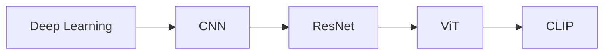
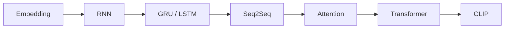

# Deep Learning 学习地图

## 这一节解决什么问题

深度学习的概念很多，但它们并不是孤立的名词。本节先回答一个导航问题：每个模型究竟在解决哪一种信息表示与传播问题？

## 一句话理解

> [!intuition]
> 深度学习是在数据和目标的约束下，逐层学习更有用的表示。

## 两条学习主线

视觉路线关注二维结构如何被表示：



序列路线关注信息如何跨位置传播：



## 共同语言：表示与 Shape

无论处理图片还是文本，我们都反复问三个问题：

1. 输入被表示成什么 Tensor？
2. 信息沿什么路径流动？
3. 输出的 Shape 为什么是这样？

一个批次的特征可以写成：

```text
X : [B, N, D]

B = batch size
N = token 或位置数量
D = representation dimension
```

## 从输入到输出完整流程

```text
Raw Data
→ Tensor
→ Representation
→ Information Mixing
→ Task Head
→ Loss
→ Gradient
→ Parameter Update
```

CNN、RNN 与 Transformer 的主要差异集中在 `Representation` 和 `Information Mixing` 两步。

## 与前后模型的关系

CNN 把局部性写入网络结构，RNN 按时间顺序传递状态，Transformer 让 Token 通过 Attention 直接建立关系。ViT 进一步把图片转换成 Token，CLIP 则把图像表示和文本表示对齐到同一语义空间。

## 我现在需要记住什么

- 模型结构是在定义信息如何表示和流动。
- Shape 是检查理解是否自洽的最快工具。
- Python 实验用来验证概念，不以训练大模型为目标。
