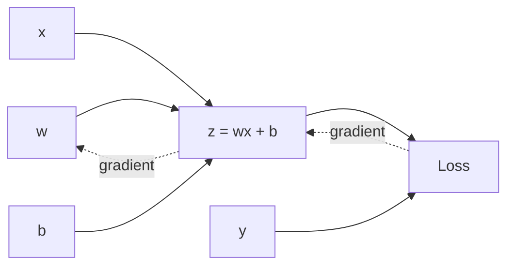

# Loss 与 Backpropagation

## 这一节解决什么问题

模型给出预测以后，训练系统如何知道每个参数应该向哪个方向改变？

## 一句话理解

Forward 用参数得到 Loss，Backward 沿计算图反向分配 Loss 对每个参数的责任。

## 核心结构

考虑一个标量模型：

$$z=wx+b, \qquad L=(z-y)^2$$

链式法则给出：

$$
\frac{\partial L}{\partial w}
=
\frac{\partial L}{\partial z}
\frac{\partial z}{\partial w}
=2(z-y)x
$$



## Shape / 数据流

在批量线性层中，`X:[B,d_in]` 与 `W:[d_in,d_out]` 得到 `Z:[B,d_out]`。反向传播得到的 `W.grad` 必须与 `W` 形状完全相同。

> [!important]
> Backpropagation 负责计算梯度。Gradient Descent、Adam 等优化器负责使用梯度更新参数。它们不是同一件事。

## Python 实验

```python exec lab="manual-gradient-vs-autograd" cell="1" title="手算梯度"
x, y = 3.0, 10.0
w, b = 2.0, 1.0
z = w * x + b
loss = (z - y) ** 2
manual_dw = 2 * (z - y) * x
print("loss:", loss, "manual dw:", manual_dw)
```

```python exec lab="manual-gradient-vs-autograd" cell="2" title="使用 PyTorch autograd"
import torch
w_t = torch.tensor(2.0, requires_grad=True)
b_t = torch.tensor(1.0, requires_grad=True)
z_t = w_t * x + b_t
loss_t = (z_t - y) ** 2
loss_t.backward()
print("autograd dw:", w_t.grad.item())
print("difference:", abs(w_t.grad.item() - manual_dw))
```

## 容易混淆的地方

- `loss.backward()` 只填充 `.grad`，不会改变参数。
- 梯度默认累加，因此训练循环每步都要清零。
- 计算图记录的是运算依赖，而不是网络层的展示图。

## 我现在需要记住什么

Backward 是链式法则在计算图上的高效实现。梯度回答的是局部敏感度，优化器才把它变成一次参数更新。
