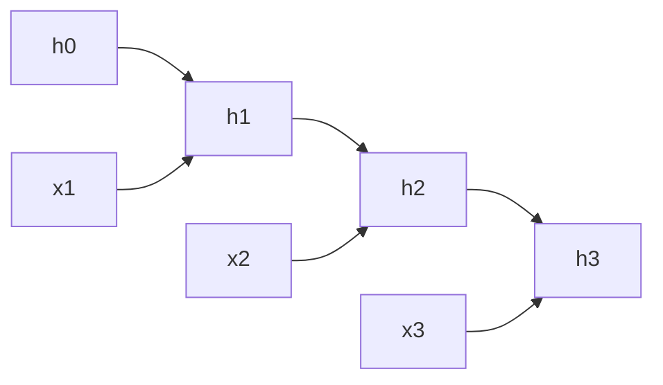

# 序列问题与 Vanilla RNN

## 这一节解决什么问题

序列中当前位置的含义依赖上下文。模型如何在处理 `x_t` 时同时利用过去的信息？

## 一句话理解

RNN 用隐藏状态（Hidden State）把到当前为止的历史压缩成一个持续更新的表示。

## 核心结构

$$h_t=\tanh(W_{hh}h_{t-1}+W_{xh}x_t+b_h)$$

$$\hat y_t=W_{hy}h_t+b_y$$

```text
x_t       = 当前输入
h_{t-1}   = 过去状态
h_t       = 加入当前输入后的新状态
y_t       = 基于当前状态的预测
```



同一组 `W_hh` 和 `W_xh` 在所有时间步共享。

## Shape / 数据流

```text
X     : [B, T, d_in]
x_t   : [B, d_in]
h_t   : [B, d_hidden]
W_xh  : [d_in, d_hidden]
W_hh  : [d_hidden, d_hidden]
```

## Python 实验

```python exec lab="vanilla-rnn-cell" cell="1" title="定义 RNN Cell"
import torch
torch.manual_seed(3)
B, T, d_in, d_hidden = 1, 5, 3, 4
X = torch.randn(B, T, d_in)
W_xh = torch.randn(d_in, d_hidden)
W_hh = torch.randn(d_hidden, d_hidden)
b = torch.zeros(d_hidden)
h = torch.zeros(B, d_hidden)
```

```python exec lab="vanilla-rnn-cell" cell="2" title="逐时间步更新状态"
states = []
for t in range(T):
    h = torch.tanh(X[:, t] @ W_xh + h @ W_hh + b)
    states.append(h)
    print(f"t={t + 1}", h)
H = torch.stack(states, dim=1)
print("all states:", H.shape)
```

## 我现在需要记住什么

RNN 的主线是 `表示 → 状态传播 → 预测`。隐藏状态让当前计算依赖过去，但也形成长路径上的梯度问题。
