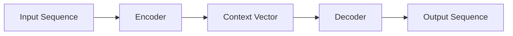

# Seq2Seq 与 Beam Search

## 这一节解决什么问题

输入与输出都是不同长度的序列时，如何用一个模型完成编码与生成？

## 一句话理解

Encoder 把输入压缩成状态，Decoder 以该状态为起点逐步生成输出。

## 核心结构



早期 Seq2Seq 的瓶颈是把整条输入压缩到固定长度 Context Vector。长输入中的细节很难全部保留。

Training 时常用 Teacher Forcing，把真实上一个 Token 喂给 Decoder。Inference 时没有真实未来答案，只能把模型自己的输出继续作为输入。

## Greedy 与 Beam Search

Greedy Search 每步选当前概率最大的 Token。Beam Search 保留 `k` 条累计得分最好的候选序列，因此能避免过早丢掉稍后可能更优的路径。

## Python 实验

```python exec lab="toy-beam-search" cell="1" title="定义候选概率"
import math
transitions = {
    "<s>": {"A": 0.55, "B": 0.45},
    "A": {"X": 0.45, "Y": 0.55},
    "B": {"X": 0.90, "Y": 0.10},
    "X": {"</s>": 1.0}, "Y": {"</s>": 1.0},
}
```

```python exec lab="toy-beam-search" cell="2" title="保留多个序列候选"
beams = [(["<s>"], 0.0)]
for _ in range(3):
    candidates = []
    for seq, score in beams:
        for token, prob in transitions[seq[-1]].items():
            candidates.append((seq + [token], score + math.log(prob)))
    beams = sorted(candidates, key=lambda item: item[1], reverse=True)[:2]
    print(beams)
```

## 我现在需要记住什么

Beam Search 是搜索策略，不会改变模型概率。固定 Context 瓶颈会直接引出 Attention：Decoder 应在需要时查询全部 Encoder State。
