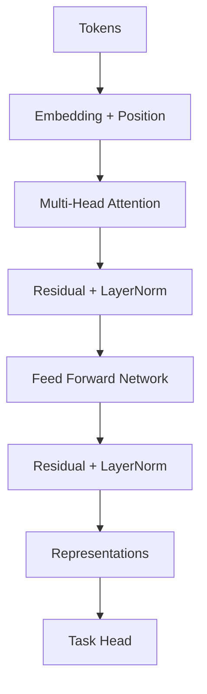

# Transformer 学习地图

## 这一节解决什么问题

Transformer 的组件很多。我们先建立完整 Mental Map，避免把 Self-Attention 当成整个 Transformer。

## 一句话理解

Transformer 让 Token 通过 Attention 交换信息，再通过 FFN 独立变换各自表示。

## 完整数据流



Block 会重复 N 次。每一层输入与输出通常都保持 `[B,N,d_model]`，这让 Residual Connection 可以直接相加。

## 与 RNN 的关键差别

RNN 的信息主要按时间方向逐步传播。Transformer 中每个 Token 能在一层 Attention 内直接读取其他可见 Token，因此训练可以对序列位置并行计算。

## Shape 主线

```text
Token IDs                [B, N]
Embedding                [B, N, d_model]
Q / K / V                [B, heads, N, d_head]
Attention Matrix         [B, heads, N, N]
Concatenate              [B, N, d_model]
Block Output             [B, N, d_model]
```

## 我现在需要记住什么

Attention 负责 Token 之间的信息交换，FFN 负责 Token 内部的表示变换，Residual 和 LayerNorm 负责稳定深层信息流。
