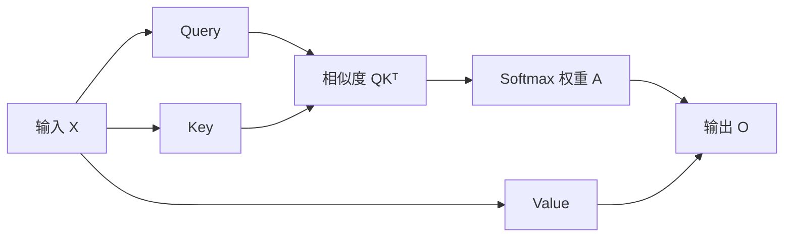

# Self-Attention

## 这一节解决什么问题

序列中的每个 Token 都需要根据当前任务，从其他 Token 中收集相关信息。Self-Attention 解决的是：如何让每个 Token 主动查询整条序列，并把查询结果重新聚合成新的表示。

## 一句话理解

> [!intuition]
> Self-Attention 是一次可学习的信息检索。每个 Token 发出 Query，用 Key 判断相关性，再从相关 Token 的 Value 中取回信息。

## 为什么需要它

RNN 主要沿时间顺序传递状态。距离很远的两个位置必须经过多次状态更新才能交换信息。Self-Attention 直接构造一个 `N × N` 的关系矩阵，让任意两个 Token 在一层内建立联系。



## 核心结构

输入表示为：

$$
X \in \mathbb{R}^{N \times d_{model}}
$$

同一个 `X` 经过三组不同的线性投影：

$$
Q=XW_Q, \qquad K=XW_K, \qquad V=XW_V
$$

Q、K、V 不是三个独立输入。它们来自同一个输入表示，只承担不同角色：

| 名称 | 直觉问题 | 作用 |
|---|---|---|
| Query | 我现在在寻找什么？ | 发出检索需求 |
| Key | 我这里有什么可被匹配？ | 描述可匹配特征 |
| Value | 如果关注我，我传递什么？ | 携带实际内容 |

## 数学表达

先计算相似度并进行缩放：

$$
S=\frac{QK^T}{\sqrt{d_k}}
$$

再沿每一行做 Softmax：

$$
A=\operatorname{softmax}(S)
$$

最后使用权重聚合 Value：

$$
O=AV
$$

合在一起就是：

$$
\operatorname{Attention}(Q,K,V)
=
\operatorname{softmax}\left(\frac{QK^T}{\sqrt{d_k}}\right)V
$$

缩放项 `√d_k` 用来控制点积随维度增大而变大的幅度。没有缩放时，Softmax 更容易进入非常尖锐的区域，梯度会变得不稳定。

## Shape / 数据流

```text
X    : [N, d_model]

W_Q  : [d_model, d_k]
W_K  : [d_model, d_k]
W_V  : [d_model, d_v]

Q    : [N, d_k]
K    : [N, d_k]
V    : [N, d_v]

QKᵀ : [N, N]
A    : [N, N]
O    : [N, d_v]
```

矩阵 `A[i, j]` 表示第 `i` 个 Token 在更新自己时，对第 `j` 个 Token 分配了多少注意力。每一行经过 Softmax，因此每行之和为 1。

> [!important]
> `N × N` 不是特征维度，而是 Token 与 Token 的关系空间。行表示谁在查询，列表示被查询的是谁。

## 从输入到输出完整流程

1. 输入 `X` 包含 `N` 个 Token，每个 Token 是 `d_model` 维表示。
2. 三组投影矩阵生成 Q、K、V。
3. `QKᵀ` 比较每个 Query 与所有 Key。
4. 除以 `√d_k` 控制数值尺度。
5. Softmax 把分数转成每行和为 1 的权重。
6. 权重矩阵与 V 相乘，得到按相关性聚合后的新表示。

## 容易混淆的地方

> [!pitfall]
> Attention Weight 不是模型最终输出。它只说明从哪些位置取信息，真正被聚合的是 Value。

- Self-Attention 的 Self 表示 Q、K、V 来自同一个序列。
- `QKᵀ` 的方向不能随意交换。交换后，行与列的查询语义也会交换。
- Softmax 通常沿最后一维进行，也就是让每个 Query 对所有 Key 的权重归一化。
- Attention 本身不包含顺序概念，位置信息需要由 Position Encoding 或 Position Embedding 注入。

## 与前后模型的关系

RNN 通过隐藏状态逐步传播信息。Attention 让当前位置直接查询所有 Encoder State。Transformer 再进一步移除循环结构，把 Self-Attention 作为主要的 Token 信息交换机制。

下一节 Multi-Head Attention 会把表示拆成多个子空间，让不同 Head 学习不同类型的关系。

## Python 实验

下面的 7 个 Cell 共享同一个 Kernel。按顺序运行，最后会得到 Attention Matrix 的热力图。

```python exec lab="self-attention-from-scratch" cell="1" title="构造输入 X"
import torch
import matplotlib.pyplot as plt

torch.manual_seed(7)
X = torch.randn(4, 8)
print("X shape:", X.shape)
print(X)
```

```python exec lab="self-attention-from-scratch" cell="2" title="构造投影矩阵"
d_model, d_k, d_v = 8, 4, 4
W_q = torch.randn(d_model, d_k)
W_k = torch.randn(d_model, d_k)
W_v = torch.randn(d_model, d_v)
print("W_q / W_k / W_v:", W_q.shape, W_k.shape, W_v.shape)
```

```python exec lab="self-attention-from-scratch" cell="3" title="计算 Q、K、V"
Q = X @ W_q
K = X @ W_k
V = X @ W_v
print("Q / K / V:", Q.shape, K.shape, V.shape)
```

```python exec lab="self-attention-from-scratch" cell="4" title="计算原始 Scores"
scores_raw = Q @ K.T
print("scores shape:", scores_raw.shape)
print(scores_raw)
```

```python exec lab="self-attention-from-scratch" cell="5" title="缩放并 Softmax"
scores = scores_raw / (d_k ** 0.5)
attention = torch.softmax(scores, dim=-1)
print("row sums:", attention.sum(dim=-1))
print(attention)
```

```python exec lab="self-attention-from-scratch" cell="6" title="聚合 Value"
output = attention @ V
print("output shape:", output.shape)
print(output)
```

```python exec lab="self-attention-from-scratch" cell="7" title="绘制 Attention Heatmap"
fig, ax = plt.subplots(figsize=(5.2, 4.2))
image = ax.imshow(attention.detach().numpy(), cmap="Greens", vmin=0, vmax=1)
ax.set_xlabel("Key position")
ax.set_ylabel("Query position")
ax.set_xticks(range(4))
ax.set_yticks(range(4))
fig.colorbar(image, ax=ax, fraction=0.046, pad=0.04)
plt.tight_layout()
plt.show()
```

## 我现在需要记住什么

- Q、K、V 来自同一个 X 的不同线性投影。
- `QKᵀ` 的 Shape 是 `[N, N]`，表达 Token 两两关系。
- Softmax 得到检索权重，`AV` 才得到更新后的表示。
- Attention 负责 Token 之间的信息交换，FFN 负责每个 Token 内部的表示变换。
