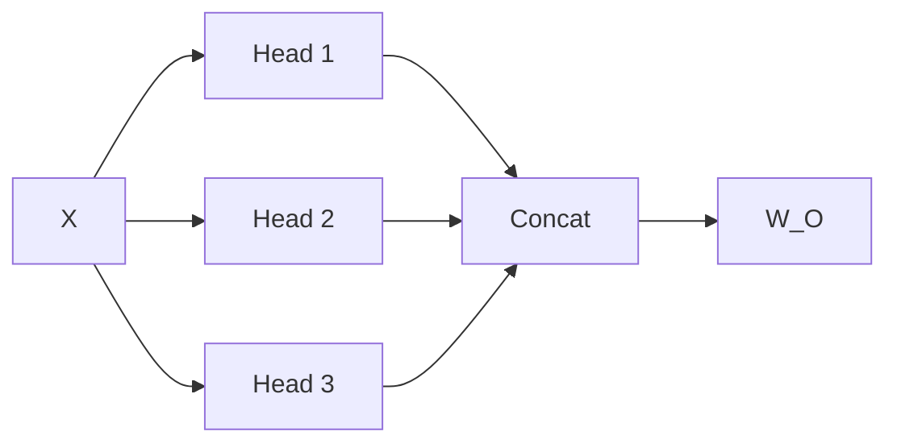

# Multi-Head Attention

## 这一节解决什么问题

一次 Attention 只在一套投影空间中计算关系。怎样让模型并行学习不同类型的匹配模式？

## 一句话理解

Multi-Head 把 `d_model` 拆成多个 `d_head` 子空间，每个 Head 独立 Attention，最后拼接并投影回原维度。

## 核心结构



通常 `d_model = heads × d_head`。例如 `512 = 8 × 64`。

## Shape / 数据流

```text
X                 [B, N, d_model]
QKV projection    [B, N, 3*d_model]
split Q/K/V       [B, N, d_model]
reshape + transpose
Q/K/V             [B, heads, N, d_head]
attention         [B, heads, N, N]
head output       [B, heads, N, d_head]
transpose + concat[B, N, d_model]
output projection [B, N, d_model]
```

## Python 实验

```python exec lab="multi-head-shape-transform" cell="1" title="拆分 Head"
import torch
B, N, d_model, heads = 2, 5, 12, 3
d_head = d_model // heads
X = torch.randn(B, N, d_model)
Q = X.reshape(B, N, heads, d_head).transpose(1, 2)
print("split:", Q.shape)
```

```python exec lab="multi-head-shape-transform" cell="2" title="恢复 Token 表示"
restored = Q.transpose(1, 2).contiguous().reshape(B, N, d_model)
print("restored:", restored.shape)
print("same values:", torch.allclose(X, restored))
```

## 容易混淆的地方

Head 不是把 Token 分组，而是把每个 Token 的特征维分组。每个 Head 仍然能看到所有可见 Token。

## 我现在需要记住什么

Split、Attention、Concat、Projection 是完整顺序。看到 `[B,heads,N,d_head]` 时，要清楚 Token 维和 Head 维的位置。
