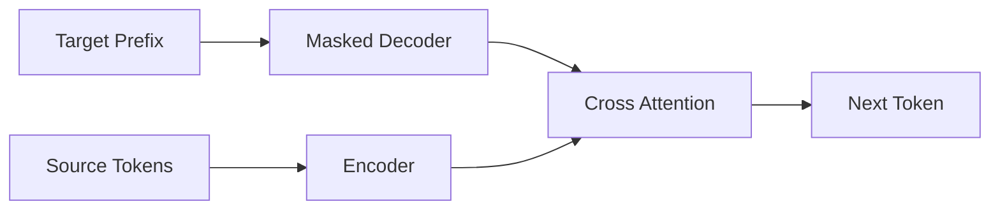

# Encoder、Decoder 与 Cross Attention

## 这一节解决什么问题

Transformer 如何同时编码输入序列并自回归生成输出？Cross Attention 又如何连接两侧？

## 一句话理解

Encoder 建立输入表示，Decoder 在受 Causal Mask 约束的输出上下文中生成，并用 Query 查询 Encoder 的 K/V。

## 三种 Attention

| 模块 | Q 来源 | K/V 来源 | Mask |
|---|---|---|---|
| Encoder Self-Attention | Encoder | Encoder | Padding |
| Decoder Self-Attention | Decoder | Decoder | Causal + Padding |
| Cross Attention | Decoder | Encoder | Encoder Padding |

Cross Attention 的关键是：

```text
Q   : Decoder 当前表示
K/V : Encoder 输出表示
```

## Shape / 数据流

```text
Encoder output : [B,N_src,D]
Decoder state  : [B,N_tgt,D]
Cross scores   : [B,H,N_tgt,N_src]
Cross output   : [B,N_tgt,D]
```

关系矩阵最后两维不必相等，因为目标序列长度与源序列长度可以不同。



## 容易混淆的地方

Cross Attention 不是把 Encoder 和 Decoder Token 直接拼接。Decoder 发出 Query，Encoder 提供可检索的 Key 与内容 Value。

## 我现在需要记住什么

判断 Attention 类型最可靠的方法是问 Q、K、V 分别来自哪里，以及哪些位置应该被 Mask。
