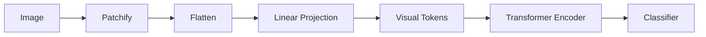

# Vision Transformer 学习地图

## 这一节解决什么问题

Transformer 的输入是 Token Sequence，而图片是像素网格。ViT 如何连接这两种表示？

## 一句话理解

ViT 把图片切成固定大小 Patch，将每个 Patch 映射为视觉 Token，再交给 Transformer Encoder。

## 完整数据流



ViT 没有发明一套全新的 Transformer。主要变化发生在输入端：`Image → Token Sequence`。

## Shape 主线

```text
Image       [B,C,H,W]
Patches     [B,N,P²C]
Tokens      [B,N,d_model]
Add CLS     [B,N+1,d_model]
Encoder     [B,N+1,d_model]
CLS output  [B,d_model]
Logits      [B,num_classes]
```

## 学习顺序

先掌握 Patch Embedding 的每一步 Shape，再理解 CLS Token 和 Position Embedding，最后用极小 ViT 把模块串起来。

## 我现在需要记住什么

ViT 的入口问题只有一个：图片如何变成 Token。后续 Attention 与 FFN 的逻辑都来自 Transformer。
