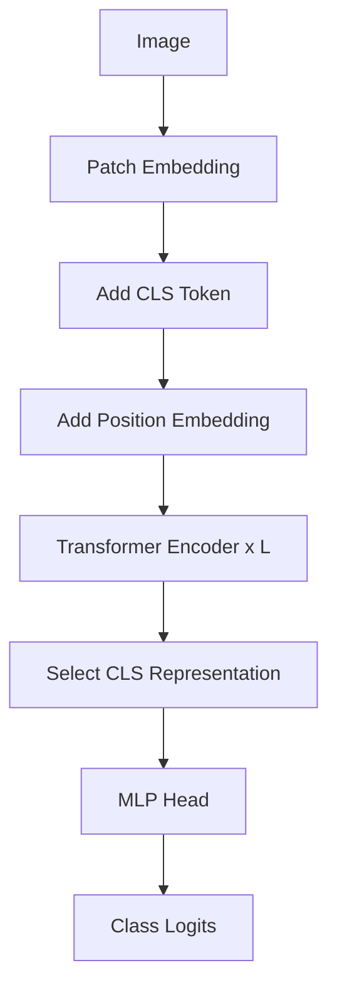

# ViT Architecture

## 这一节解决什么问题

得到 Patch Token 以后，ViT 如何形成整幅图的分类表示？

## 一句话理解

ViT 在 Patch Sequence 前加入可学习 CLS Token，再用 Transformer Encoder 让它通过 Attention 聚合图像信息。

## 核心结构



CLS Token 是一个可学习向量。它不是预先写好的“图片摘要”，而是在训练中通过 Attention 学会聚合任务相关信息。

## Shape / 数据流

```text
Patch Tokens     [B,N,D]
CLS              [1,1,D] → expand [B,1,D]
With CLS         [B,N+1,D]
Position         [1,N+1,D]
Encoder Output   [B,N+1,D]
CLS Output       [B,D]
Logits           [B,K]
```

## 容易混淆的地方

CLS 输入向量在不同图片间共享，但经过 Encoder 后的 CLS 输出依赖当前图片。Position Embedding 也需要覆盖新增的 CLS 位置。

## 与前后模型的关系

分类可以读取 CLS，也可以对 Patch Token 做平均池化。CLIP 的 ViT Image Encoder 最终也需要把整幅图压缩成一个向量，再投影到共享语义空间。

## 我现在需要记住什么

ViT 主干保持标准 Transformer Encoder。理解 CLS 的关键是区分“可学习输入 Token”和“上下文化后的输出表示”。
