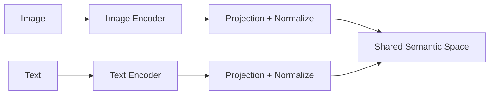

# CLIP 学习地图

## 这一节解决什么问题

ViT 能把图片变成向量，Text Transformer 能把文本变成向量。怎样让匹配的图文向量靠近，不匹配的远离？

## 一句话理解

CLIP 使用对比学习（Contrastive Learning）对齐图像表示与文本表示。

## 核心结构



CLIP 学到的是图文匹配关系，不是图片生成文字，也不是文字生成图片。

## Shape 主线

```text
Images           [B,C,H,W]
Image Features   [B,D]
Text IDs         [B,N]
Text Features    [B,D]
Similarity       [B,B]
```

Similarity Matrix 的对角线对应 Batch 中配对的图文样本。

## 能力边界

对齐空间支持跨模态检索和 Zero-Shot Classification，但不自然提供长文本生成、复杂推理或动作输出。这些能力会在未来 VLM 与 VLA 中继续组合。

## 我现在需要记住什么

CLIP 的核心不是某个特定 Image Encoder，而是 Dual Encoder、共享空间和对称对比损失。
