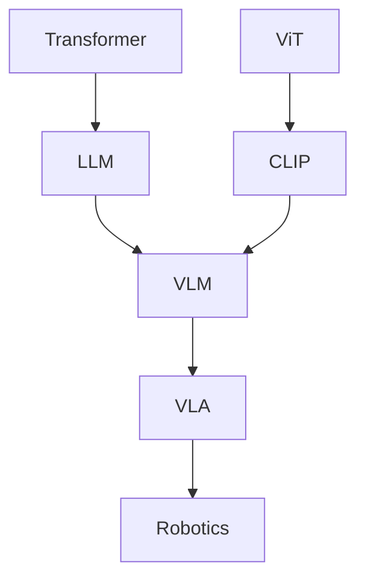

# 从 CLIP 到 VLM

## 这一节解决什么问题

图文表示已经被对齐，为什么 CLIP 还不是一个能对话、推理并操作世界的视觉语言模型？

## 一句话理解

CLIP 解决 Alignment，VLM 还需要把视觉信息接入能够生成语言和推理的模型。

## CLIP 已经具备的能力

```text
Image → Semantic Representation
Text  → Semantic Representation
      → Similarity / Retrieval / Zero-Shot
```

## 仍然缺少什么

- 长文本理解与生成
- 多步视觉推理
- 视觉问答中的细粒度交互
- 基于环境反馈的动作输出

CLIP 的两个独立 Encoder 最终只输出全局向量，适合匹配，却不会逐 Token 生成回答。

## 未来路线



> [!bridge]
> VLM 往往需要视觉 Encoder、连接模块与语言模型协同工作。VLA 再把模型输出扩展到 Action。这里先保留路线，不提前展开实现。

## 我现在需要记住什么

Alignment、Generation、Reasoning 和 Action 是不同能力层。CLIP 是视觉与语言相遇的重要起点，但不是终点。
